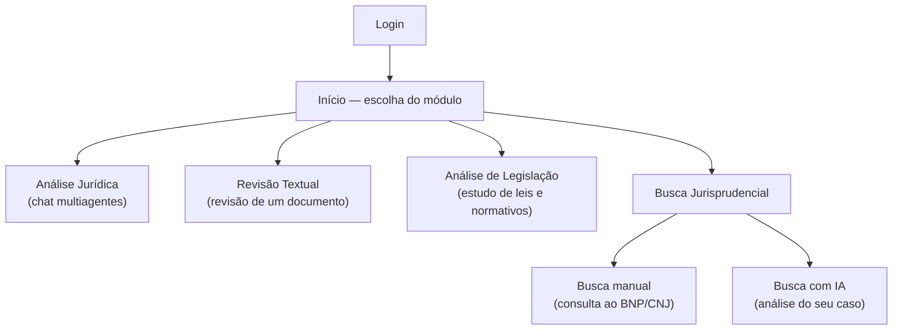
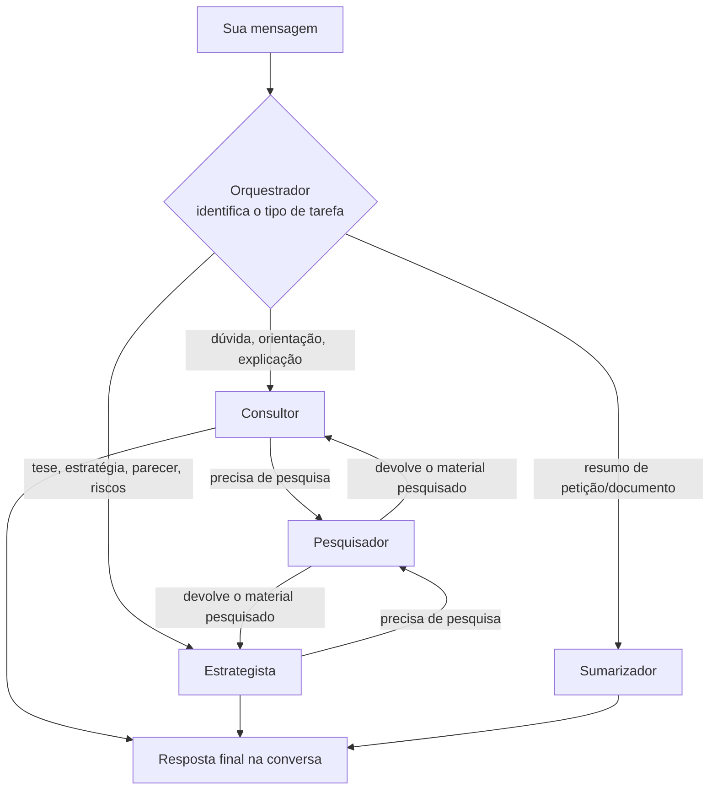
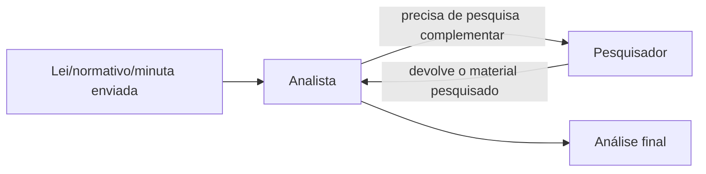
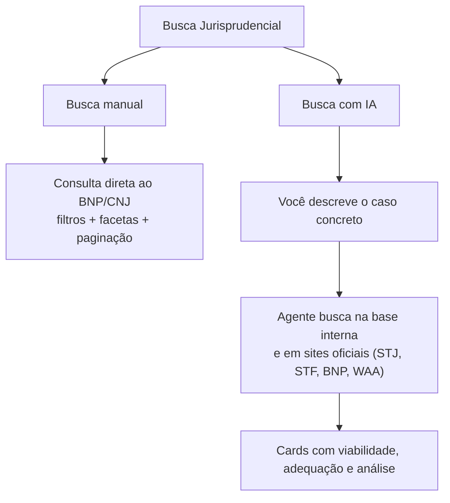

# Manual do Usuário — WGPT

Objetivo desse repositório é explicar **o que cada tela faz**, **como a IA decide quem responde** e **como escrever pedidos** para obter as melhores respostas.

---

## 1. Visão geral

Depois do login, você chega na tela **Início**, onde escolhe um dos módulos disponíveis:

| Módulo | Para que serve |
|---|---|
| **Análise Jurídica** | Conversa (chat) para dúvidas, teses, estratégias, riscos e resumos. Por trás, vários agentes especializados dividem o trabalho — veja a seção 2. |
| **Revisão Textual** | Envie um texto ou documento e receba uma avaliação de redação (ortografia, clareza, estrutura). Revisão única, sem follow-up de conversa. |
| **Análise de Legislação** | Envie uma lei, portaria ou normativo, e receba uma análise de adequação, riscos e oportunidades, com apoio de pesquisa quando necessário. Análise única, sem follow-up de conversa. |
| **Busca Jurisprudencial** | Já disponível, com **dois modos**: busca manual direta no Banco Nacional de Precedentes (BNP/CNJ) e busca com IA, que analisa o seu caso concreto e devolve precedentes avaliados. Veja a seção 4. |

---

## 2. Como o Orquestrador escolhe o agente certo (Análise Jurídica)

No módulo **Análise Jurídica**, sua mensagem nunca é respondida "no escuro" por um único robô genérico. Ela primeiro passa pelo **Orquestrador**, que lê o pedido (e a instrução que você eventualmente selecionou — ver seção 3) e decide **qual especialista** deve assumir a resposta, com base no tipo de tarefa identificada. O Orquestrador nunca elabora a resposta jurídica em si — só direciona.

O Orquestrador também sabe lidar com duas situações antes de rotear:

- **Perguntas sobre a própria plataforma** — se você perguntar o que ele ou os demais agentes fazem (ex.: "quais análises você consegue fazer?"), ele responde brevemente explicando as funcionalidades e especialidades disponíveis, em vez de tentar encaminhar isso como se fosse uma tarefa jurídica.
- **Pedidos genuinamente ambíguos** — se a tarefa não puder ser identificada mesmo pelo contexto (ex.: "preciso de uma análise", sem dizer análise do quê), o Orquestrador pede um esclarecimento objetivo antes de escolher o especialista, em vez de arriscar um encaminhamento errado. Se o pedido já tiver informação suficiente para inferir a natureza da tarefa, ele segue direto para o especialista, sem perguntas desnecessárias.

### Os agentes e suas especialidades

| Agente | Especialidade | Aparece na conversa? |
|---|---|---|
| **Orquestrador** | Só direciona — identifica a natureza do pedido e passa a tarefa ao especialista certo. Explica as funcionalidades da plataforma quando perguntado e pede esclarecimento em pedidos genuinamente ambíguos. Não elabora a resposta final e **não pesquisa nada por conta própria**. | Não responde diretamente |
| **Consultor** | Orientações jurídicas objetivas e dúvidas em geral (conceitos, dúvidas processuais). Pode acionar o Pesquisador. | Sim |
| **Estrategista** | Teses jurídicas, estratégias de defesa, pareceres técnicos, análise de viabilidade e riscos, contraposição de argumentos. Pode acionar o Pesquisador. | Sim |
| **Sumarizador** | Resumo e extração de informações de documentos jurídicos anexados. **Não tem acesso ao Pesquisador** — trabalha só com o que foi anexado/enviado na conversa. | Sim |
| **Pesquisador** | Busca jurisprudência, legislação e conteúdo na internet. Na jurisprudência, uma **única busca combinada** consulta a base interna de precedentes **e**, na sequência, os sites oficiais (STJ, STF, BNP/CNJ e WAA), lendo inclusive acórdãos em PDF publicados nesses sites. **Nunca responde você diretamente** — sempre entrega o resultado da pesquisa de volta para quem o acionou concluir a resposta. | Não responde diretamente |

Importante: quem decide acionar o Pesquisador é o **agente especializado que está com a tarefa** (Consultor ou Estrategista) no meio da própria resposta, sempre que perceber que precisa de uma fonte (lei, jurisprudência ou informação atual) antes de concluir — o Orquestrador não pesquisa e não aciona o Pesquisador diretamente, e o Sumarizador não tem essa opção.

No painel **"Ver raciocínio"** abaixo de cada resposta, você acompanha em tempo real qual agente está ativo, quando ocorre um repasse (handoff) para outro agente e quais ferramentas de pesquisa foram consultadas — útil para conferir a base da resposta antes de confiar nela.

## 3. Boas práticas de prompt

Quanto mais contexto e mais claro o objetivo, melhor o agente identifica a tarefa e melhor é a resposta. Evite pedidos genéricos, especialmente quando há um documento anexado.

### Use as sugestões de instrução (pills)

Na Análise Jurídica, acima do campo de mensagem existem **pills de instrução** organizadas por categoria — clicar em uma delas já direciona o tom e o tipo de tarefa para o Orquestrador:

| Categoria | Instruções disponíveis |
|---|---|
| **Orientação** | Explicar conceitualmente • Tirar dúvida processual |
| **Estratégia** | Desenvolver tese • Revisar fundamentações • Analisar viabilidade e riscos • Elaborar parecer técnico • Contrapor argumentos |
| **Documentos** | Resumir petição |

A pill selecionada é somada à sua mensagem antes do envio e se desmarca sozinha depois — você pode digitar livremente além dela.

### Exemplos — do genérico ao eficaz

| ❌ Evite | ✅ Prefira | 💡 Motivo |
|---|---|---|
| "Me ajude com essa petição" (com anexo) | "Analise a viabilidade de recurso neste acórdão anexo, focando em prequestionamento e violação ao art. 927 do CPC. Traga um parecer estruturado com riscos e prazo recursal. | Explicar o documento e sua estrutura, poupa tokens que seriam utilizados para o agente identificar o tipo de tarefa que irá executar, e comprender o documento anexado." |
| "O que diz a lei sobre isso?" | "Explique conceitualmente os requisitos de estabilidade do servidor público estatutário segundo a Lei 8.112, citando os artigos aplicáveis." | Define o objeto central da análise sem que o agente precise adivinhar. |
| "Resume esse documento" | "Resuma a petição anexa em até 10 tópicos, destacando pedido principal, fundamentos jurídicos e valor da causa." | Define o foco da busca, melhorando o resultado para o que se pretende. |
| "Essa tese está boa?" | "Revise as seguintes fundamentações e aponte contradições ou lacunas argumentais, sugerindo ajustes." | Prioriza elementos específicos na revisão para que o agente analise os conteúdos mais relevantes.  |

Dicas gerais:
- Diga **o que você quer receber de volta** (parecer, lista de riscos, tópicos, comparação) — não só o tema.
- Informe **contexto mínimo**: partes, datas, área do direito, instância processual.
- Se anexar um documento, **diga o que fazer com ele** — o agente não adivinha o objetivo só por receber o arquivo.
- Para casos com múltiplas perguntas, prefira dividir em mensagens separadas (lembre-se do limite de 5 mensagens por conversa — seção 7).

---

### 

### Análise de Legislação — fluxo dedicado

O módulo **Análise de Legislação** usa uma dupla própria, sem passar pelo Orquestrador:

O **Analista** é especializado em estudo de legislações, portarias e normativos (adequação, riscos, compliance, oportunidades de atuação) e pode acionar o Pesquisador quando precisar de apoio.

---

### Revisão Textual — agente único, sem repasses

O módulo **Revisão Textual** usa apenas o **Revisor**, especializado em revisão de textos jurídicos (ortografia, clareza, coesão, estrutura argumentativa). Não há conversa nem histórico: cada revisão é um envio único e independente.

---

## 4. Busca Jurisprudencial — dois modos

Ao abrir o módulo **Busca Jurisprudencial**, você escolhe entre dois cards. Cada modo tem um botão **"Voltar"** para retornar a essa escolha.

| | **Busca manual** | **Busca com IA** |
|---|---|---|
| O que você informa | Palavras-chave, tema, súmula ou nº do precedente | A descrição do seu caso concreto (até 1000 caracteres) |
| Quem processa | Ninguém — é consulta direta à base pública | Um agente de IA especializado em jurisprudência |
| O que você recebe | Lista de precedentes do BNP, como estão na base | Precedentes já avaliados frente ao seu caso, com análise |
| Quando usar | Você já sabe o que procurar e quer a fonte crua | Você quer saber se existe jurisprudência que sustente o seu caso |

### 4.1 Busca manual (BNP/CNJ)

Consulta direta e imediata ao **Banco Nacional de Precedentes** do CNJ — não passa por IA, então não há interpretação nem risco de invenção: o que aparece é exatamente o que está publicado na base.

- **Barra de busca** — pesquisa geral por tese, tema, súmula ou palavras-chave.
- **Filtros avançados** — "Todas as palavras", "Qualquer palavra", "Sem as palavras", "Trecho exato" (expressão literal) e "Nº do precedente".
- **Facetas por Órgão e Espécie** — caixas de seleção com a contagem de precedentes, para restringir os resultados ao tribunal ou ao tipo de precedente desejado.
- **Cards de resultado** — espécie, número, órgão, situação, data de atualização, questão submetida, tese firmada e, quando disponível, o **link do processo paradigma** para leitura na íntegra.
- **Paginação** — até 30 resultados por página.

> **Observação sobre as contagens das facetas:** os números ao lado de cada órgão/espécie refletem apenas a busca textual e não diminuem conforme você marca filtros de órgão ou espécie. É o comportamento da própria API do CNJ, não um erro da tela.

Não há filtro de período nem de ordenação: esses parâmetros existem na API do CNJ, mas foram testados e não produzem efeito confiável, então não foram expostos para não criar controles que não fazem nada.

### 4.2 Busca com IA

Aqui você **não** digita palavras-chave: descreva o caso concreto, com o máximo de contexto útil (fatos, parte envolvida, direito discutido, instância). Mínimo de 20 e máximo de 1000 caracteres. Depois clique em **"Analisar caso"**.

O agente então:
1. Busca precedentes na **base interna de jurisprudências** do escritório e, na sequência, nos **sites oficiais** (STJ, STF, BNP/CNJ e WAA) — inclusive abrindo e lendo acórdãos publicados em PDF;
2. Avalia cada precedente encontrado frente ao caso que você descreveu;
3. Devolve os resultados em cards.

Cada card traz:

| Campo | O que significa |
|---|---|
| **Tribunal e nº do processo** | Identificação do precedente |
| **Resumo** | Do que trata a decisão |
| **Viabilidade** | Se o precedente é **favorável**, **parcial** ou **desfavorável** ao seu caso |
| **Adequação ao caso** | Barra de 0 a 100% indicando o quanto o precedente se encaixa nos fatos descritos |
| **Análise** | Texto explicando por que o precedente ajuda (ou não), encerrado sempre com a **fonte**: link clicável 🔗 para precedentes vindos da web, ou "🔗 Base Jurisprudências.xlsx" para os da base interna |

Enquanto processa, a tela mostra o progresso ("Buscando e analisando jurisprudências…" → "Organizando os resultados…"). Abaixo dos cards, o bloco **"Resultados das consultas"** reúne o material bruto retornado pelas buscas, separado em seções "Base Vetorial" e "Web" — útil para conferir de onde veio cada informação.

O botão **"Reiniciar"** (topo direito) cancela uma busca em andamento e limpa a descrição e os resultados.

**Como descrever bem o caso:**

| ❌ Evite | ✅ Prefira |
|---|---|
| "aposentadoria especial" | "Servidor público federal, professor de universidade, pleiteia contagem especial de tempo de serviço em atividade insalubre anterior à EC 103/2019, com pedido de averbação para aposentadoria." |
| "dano moral servidor" | "Servidor teve remuneração suspensa por 4 meses em processo administrativo depois anulado; busco precedentes sobre dano moral in re ipsa nessa situação." |

**Importante:** a busca com IA é uma ferramenta de pesquisa, não de decisão. Sempre confira o precedente na fonte (link no fim da análise) antes de usá-lo em uma peça.

> Não há histórico nem conversa em nenhum dos dois modos: cada busca é independente e os resultados se perdem ao sair da tela ou clicar em "Reiniciar".

---

## 5. Formato e formatação de arquivos para anexar

| Formato | Suportado? | Observações |
|---|---|---|
| `.pdf` | ✅ Sim | Cada página é enviada como imagem para o modelo "ler" diretamente — inclusive digitalizações/scans, sem necessidade de OCR à parte. Limite de leitura: 15 páginas por arquivo. |
| `.docx` | ✅ Sim | Texto extraído normalmente, mais imagens relevantes incorporadas no corpo do documento (ícones e logos pequenos são ignorados automaticamente). |
| `.txt` | ✅ Sim | Apenas texto simples. |
| `.doc` (Word 97-2003) | ❌ Não suportado | Salve como `.docx` antes de anexar ("Salvar como" → Word Document `.docx`). |

**Limite de tamanho:** 10 MB por arquivo.

Boas práticas ao anexar:
- Prefira **um documento por envio**, com propósito único (a petição, o acórdão, a minuta) em vez de compilados de vários arquivos colados em um só.
- Em PDFs digitalizados, garanta **boa legibilidade** (escaneamento reto, sem cortes, resolução legível) — como o modelo "enxerga" a página como imagem, texto borrado ou torto prejudica a leitura.
- Documentos muito longos (acima de 15 páginas em PDF) podem ter conteúdo além do limite ignorado — para peças extensas, considere enviar apenas as seções relevantes.
- Combine o anexo com uma instrução clara no texto da mensagem (ver seção 3).

> A Busca Jurisprudencial (seção 4) não aceita anexos em nenhum dos dois modos — na busca com IA, descreva o caso por escrito na própria caixa de texto.

---

## 6. Seleção de fontes (tools) no modo Análise Jurídica

Ao lado do campo de mensagem, dois controles permitem restringir onde o Pesquisador vai buscar informação:

- **Ícone de biblioteca ("Consultar fontes")** — abre uma lista com nove bases jurídicas: Jurisprudências, Roteiro de Ações, Constituição Federal, Código de Processo Civil, Lei 8.112, Lei 8.213, Lei 9.717, Lei 9.784 e Lei 12.772. Marque apenas as bases relevantes ao caso para focar a pesquisa e acelerar a resposta.
- **Ícone de globo ("Buscar na web")** — habilita pesquisa na internet (útil para notícias jurídicas recentes, mudanças normativas muito novas ou temas fora das bases internas).

Se nenhuma fonte for marcada, o Pesquisador decide sozinho quais bases consultar, conforme identificar necessidade durante a resposta. Marcar fontes específicas é recomendado quando você já sabe qual legislação rege o caso — isso reduz buscas desnecessárias e deixa a resposta mais objetiva.

**Sobre a fonte "Jurisprudências":** ela não se limita mais à base interna. Ao ser acionada, faz **uma única busca combinada** — primeiro na base interna de precedentes do escritório e, em seguida, na web restrita a **domínios oficiais** (STJ, STF, BNP/CNJ e WAA), inclusive baixando e lendo acórdãos em PDF publicados nesses sites. Dois efeitos práticos:

- Você **não precisa** marcar também o globo ("Buscar na web") para obter jurisprudência atual — a busca de jurisprudência já cobre a web sozinha, e sempre dentro de sites oficiais (não retorna blogs, dicionários ou fontes não confiáveis).
- A busca de jurisprudência roda **uma vez por pedido**. Se o painel de raciocínio mostrar uma mensagem de "já utilizou esta ferramenta", não é erro: o agente está sendo impedido de repetir a mesma pesquisa e vai concluir a resposta com o material já obtido. Para uma nova busca com outro recorte, envie uma nova mensagem.

---

## 7. Por que exportar a conversa é importante

O histórico da Análise Jurídica **não fica salvo em nenhum servidor** — ele existe apenas na aba do navegador, durante a sessão atual. Isso significa que:

- Fechar a aba, limpar o cache ou trocar de navegador **apaga a conversa permanentemente**.
- Cada conversa tem um **limite de 5 mensagens enviadas pelo usuário**; ao atingir o limite, o envio é bloqueado e é preciso iniciar uma nova conversa (o conteúdo da anterior não é recuperado automaticamente).

Por isso, use o botão **"Exportar .docx"** (disponível a partir da primeira resposta do agente, no topo da tela) sempre que quiser preservar um raciocínio, parecer ou pesquisa importante — o arquivo gerado inclui a conversa formatada, pronta para arquivar ou compartilhar. Os módulos de Revisão Textual e Análise de Legislação também oferecem exportação em `.docx` do resultado.

**Recomendação:** exporte antes de encerrar o expediente ou sempre que a conversa chegar a um ponto de conclusão relevante — não deixe para o final, especialmente perto do limite de 5 mensagens.

---

## Changelog 

**21/07/2026:**
- Busca jurisprudencial na web passou a ler também **acórdãos em PDF** publicados nos sites oficiais, antes mal aproveitados.
- Resultados de busca web agora são filtrados por domínio oficial (STJ, STF, BNP/CNJ, WAA) — sem vazamento de blogs, dicionários e fontes não jurídicas.
- Corrigidas buscas repetidas: cada ferramenta de pesquisa roda uma única vez por pedido, deixando o painel de raciocínio mais limpo e as respostas mais rápidas.

**17/07/2026:**
- Na Análise Jurídica, a fonte **Jurisprudências** virou uma busca única e combinada: base interna de precedentes **+** sites oficiais, sem precisar habilitar o globo de busca web (seção 6).

**16/07/2026:**
- Novo módulo **Busca Jurisprudencial** liberado, com dois modos: **busca manual** no Banco Nacional de Precedentes (BNP/CNJ) e **busca com IA**, que analisa o caso concreto descrito por você e devolve precedentes com viabilidade, adequação, análise e link da fonte (seção 4).

**29/06/2026:**
- Adicionada ferramenta de OCR para leitura de imagens no corpo de arquivos .pdf e .docx.
- Separado módulo de "Análise de Legislação" para revisão única.